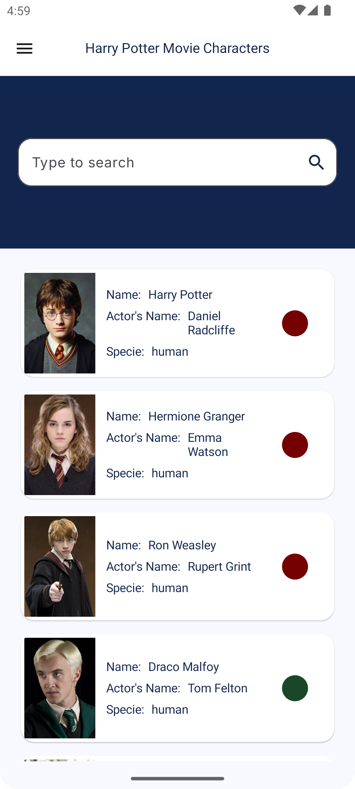

# HarryPotterCharacters 
The application lists the characters in the movie, Harry Potter

## Tech stack & libraries
- Minimum SDK level 28.
- Target SDK level 34
- Kotlin application utilizing coroutines for asynchronous tasks.
- Jetpack Libraries:
    - Jetpack Compose
    - ViewModel
    - Room
    - Hilt
- Architecture:
    - MVVM Architecture (View - ViewModel - Model)
    - Repository Pattern
- Retrofit2
- ksp
- Coil - Image loading library
- Unit Tests
- Instrumentation Tests

## Architecture
**HarryPotterCharacters** adheres to the MVVM architecture and implements the Repository pattern.

### App Implementation

